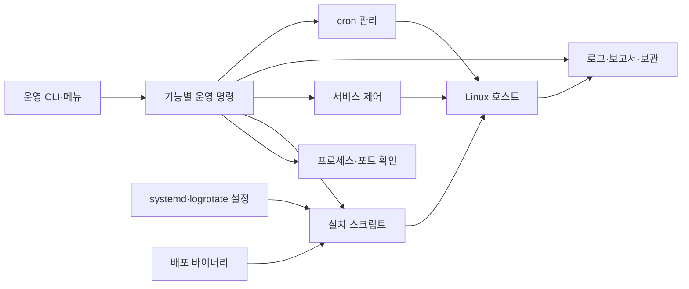

# 리눅스 서비스 운영 자동화

## 프로젝트 소개

`agent-app`의 설치·실행·관제를 위한 Python CLI와 셸 스크립트입니다. 서비스 계정, 권한, systemd, cron, 리소스 모니터링, 로그 보관을 하나의 운영 흐름으로 구성합니다.

## 핵심 특징

- 서비스 상태·진단·시작·중지·재시작
- systemd 실행과 비지원 환경의 백그라운드 실행
- CPU·메모리·디스크 샘플과 로그 통계
- cron 등록 상태 확인과 주기적 모니터링
- logrotate의 10MB 기준 회전과 최대 10개 보관
- 계정·그룹별 파일 접근 권한 분리

## 아키텍처

`service-ops → src/service_ops/actions → 운영 명령·셸 스크립트 → 리눅스 서비스` 흐름입니다. 실제 설치 자산과 시스템 설정 템플릿은 구현 패키지 밖에 둡니다.

| 경로 | 역할 |
| --- | --- |
| `src/service_ops/` | 운영 CLI와 진단 |
| `scripts/apply_system.sh` | 계정·권한·서비스 설치 |
| `scripts/agent/` | 모니터링과 통계 보고 |
| `config/systemd/`, `config/logrotate/` | 시스템 설정 템플릿 |
| `assets/agent-app/` | 기존 x86·ARM 배포 바이너리와 압축본 |
| `docs/operations.md` | 설치·운영·검증 절차 |



소스는 `src/service_ops/`, 회귀 테스트는 `tests/`, 개발 보조 도구는 `scripts/`에 둡니다. `pyproject.toml`이 패키지·명령·개발 도구를 선언하고 `uv.lock`이 설치 버전을 고정합니다. `uv sync --frozen`은 소스를 개발 모드로 설치하므로 앱 실행과 테스트에 별도 `PYTHONPATH` 설정이 필요하지 않습니다.

## 실행 환경과 시작하기

Python 3.10 이상과 Bash가 필요합니다. 실제 운영에는 Linux, `/proc`, 서비스·cron·로그 관리 도구 및 설치 권한이 필요합니다. 로컬 문법 검사에는 관리자 권한이나 대상 앱 설치가 필요하지 않습니다.

```bash
uv sync --frozen
uv run --frozen service-ops --help
make check
make test
make smoke
make build
```

운영 CLI는 저장소 루트에서 실행합니다. 인자가 없으면 대화형 메뉴가 열립니다. 운영 환경을 준비한 후 `uv run --frozen service-ops status`와 `uv run --frozen service-ops doctor`로 상태를 확인합니다.

## 설치와 운영

`install`은 사용자·그룹, `/home/agent-admin/agent-app`, `/var/log/agent-app`, cron, logrotate, SSH·방화벽 설정을 변경합니다. 적용 대상이 준비된 실습 호스트인지 확인한 뒤 [운영 안내](docs/operations.md)를 따릅니다.

CI와 `make smoke`는 도움말과 기존 문법 검사만 실행합니다. 설치·서비스 시작·cron 등록을 자동 실행하지 않습니다.

## 검증 범위

문법 검사와 실제 호스트 검증은 구분합니다. 계정·권한·포트·로그 증가는 [운영 안내](docs/operations.md)에 따라 적용 대상에서 확인합니다. 바이너리는 제공된 자산이며 이 레포에서 빌드하는 소스는 포함하지 않습니다.

`make check`는 정적 분석·포맷·문서 검사를, `make test`는 `uv run --frozen pytest -q`로 저장소의 회귀 테스트를 실행합니다. 도움말·문법 검사, cron 실패 전달, TCP 리스너·방화벽 판정, 로그 통계·회전본 개수, 서비스 제어의 실패·취소 경로를 임시 파일과 모의 시스템 명령으로 검증합니다. `make smoke`는 이 중 도움말과 문법 검사만 선택합니다(`uv run --frozen pytest -q -m smoke`). 실제 설치·서비스 부팅·권한·cron 스케줄 실행·logrotate 회전은 전용 호스트에서 별도로 검증해야 합니다.
